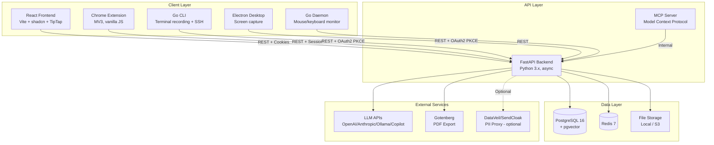

# Ondoki — Codebase State (as of Feb 2026)

## Executive Summary

Ondoki is a **process documentation platform** — users record workflows (screen captures of browser/desktop steps), and the system generates step-by-step guides with AI-annotated descriptions. It has a rich document editor (TipTap), project/folder organization, team collaboration, AI chat, semantic search (RAG), an MCP server for AI agent integration, and a Chrome extension + CLI for capturing workflows. Think "Scribe/Tango competitor" but self-hostable.

The **core platform (ondoki-web)** is the real product and is substantially built — ~195K LOC Python backend, ~51K LOC TypeScript frontend, 19 Alembic migrations, 180 API endpoints, 277 tests across 22 test files. It has real features: auth (session cookies + PKCE OAuth2), team projects with RBAC, folder hierarchies, document versioning, public sharing, AI chat with tool-calling, embeddings/RAG, git sync, audit logging, analytics, MCP protocol support, PDF export via Gotenberg, video import with frame extraction. This is a legitimate product with significant depth.

**The honest assessment:** The core platform is impressive for what appears to be a small team / solo developer effort. However, the ecosystem suffers from **severe fragmentation** — there are **7+ abandoned desktop app attempts** across different tech stacks (WPF, Qt, Swift, Electron, native macOS, native Windows), plus legacy repos (Firebase/Next.js `ondoki`, Node.js `ondoki-api`, Ruby `ondoki_ruby`). The Electron app has the most traction at 8.3K LOC but the recording approach differs from the daemon. The Chrome extension is functional but small (~1.5K LOC). Rate limiting is in-memory only (resets on restart). No Redis-backed rate limiting despite Redis being in the stack. The dataveil repo has been rebranded to "SendCloak" and is a separate product (LLM privacy proxy), not tightly coupled.

## Architecture Overview

## Component Analysis

### ondoki-web (Core Platform)

#### Frontend
- **Tech stack:** React 19.1, Vite 7, TypeScript, Tailwind CSS, shadcn/ui, React Router, TanStack React Query, Zustand
- **Component count:** 265 `.tsx` files across 18 component directories
- **LOC:** ~51,400 lines TypeScript/TSX
- **Pages:** 19 page components (EditorPage, LoginPage, WorkflowView, FolderView, DocumentGallery, AnalyticsDashboard, AuditLog, ContextLinks, KnowledgeBase, KnowledgeGraph, VideoImport, PublicWorkflow, PublicDocument, SharedWithMe, Team, ProjectSettings, JoinProject, DeviceAuth, TextContainerPage)
- **State management:** Zustand for local stores (tableDataStore, VariableStore), TanStack Query for server state — reasonable approach
- **Editor (TipTap):** Heavy investment — 21 TipTap packages including: starter-kit, tables, images, math (KaTeX), emoji, mentions, drag-handle, horizontal-rule, text-align, typography, subscript/superscript, unique-id, text-style, highlight, lists. This is a serious document editor.
- **UI quality:** Using shadcn/ui component library — modern, consistent. Has error boundaries, auth guards, chat provider context.
- **Routing:** React Router with nested layout pattern. Has both `App.tsx` (marked as unused) and `main.tsx` as entry point — minor dead code.

#### Backend (API)
- **Tech stack:** Python/FastAPI, async, SQLAlchemy (async), Alembic, httpx
- **LOC:** ~194,600 lines Python (including tests, migrations)
- **Endpoint count:** 180 route handlers across 25 router files
- **Routers:** auth, user, project, document, folder, process_recording, chat, inline_ai, search, shared, context_links, comments, git_sync, mcp_keys, audit, knowledge, analytics, links, video_import, auth_providers, health, public, text_container, test_helpers

##### Database Schema
- **Tables:** 20+ models — User, Project, Document, DocumentVersion, Folder, ProcessRecordingSession, ProcessRecordingStep, ProcessRecordingFile, Session, AuthCode, RefreshToken, AppSettings, project_members, ResourceShare, Embedding (pgvector), LLMUsage, GitSyncConfig, Comment, ContextLink, McpApiKey, KnowledgeSource, AuditLog, KnowledgeLink, TextContainer
- **Relationship complexity:** Moderate-high. Materialized path for folder hierarchy. Many-to-many for project members with RBAC roles. Polymorphic resource sharing (workflow/document). Vector embeddings for RAG.
- **Notable:** Dual `owner_id` + `user_id` on Project (backward compat comment suggests migration pain). Privacy flags (is_private) on folders, documents, workflows.

##### Auth System
- Session-based cookies for web frontend (server-side sessions in DB with token hash, expiry, revocation)
- OAuth2 PKCE flow for desktop/CLI clients (auth codes + refresh tokens)
- GitHub Copilot auth provider integration
- In-memory rate limiting on login/password-reset (resets on server restart — **weakness**)
- Separate `RateLimiter` middleware class exists for public endpoints

##### Test Coverage
- **22 test files, 277 test functions**
- **What's covered:** auth, auth_extended, chat, chat_extended, document, document_export, document_extended, document_locking, folder, folder_extended, health, knowledge, links, process_recording, project, project_extended, search, sharing, user, ai_tools, analytics, audit
- **What's NOT covered:** video_import, git_sync, mcp_keys, context_links, comments, inline_ai, auth_providers (copilot), text_container — significant gaps in newer features
- **Test infrastructure:** Has conftest.py with fixtures, separate test DB setup in Docker

##### Migration State
- **19 migrations** (001_initial through 019_add_video_import) — clean sequential numbering, no apparent conflicts
- Each migration targets a specific feature — well-organized

##### Services
| Service | Purpose | Maturity |
|---------|---------|----------|
| `llm.py` | Provider-agnostic LLM gateway (OpenAI, Anthropic, Ollama, Copilot, custom) | Solid — has circuit breaker |
| `embeddings.py` | Vector embeddings for RAG | Functional |
| `search_indexer.py` | Full-text search indexing (tsvector) | Functional |
| `indexer.py` | General indexing | Functional |
| `auto_processor.py` | AI auto-annotation of workflow steps | Functional |
| `dataveil.py` | Integration with DataVeil/SendCloak PII proxy | Optional/thin wrapper |
| `audit.py` | Audit logging service | Functional |
| `access.py` | Permission/access control checks | Core |
| `crypto.py` | Fernet encryption for API keys at rest | Functional |
| `usage_tracker.py` | LLM token usage tracking | Functional |
| `analytics.py` | Usage analytics | Functional |
| `link_detector.py` | Auto-detect links between resources | Functional |
| `video_processor.py` | Video import → frame extraction → transcription | Newer, less tested |
| `auth_providers/copilot.py` | GitHub Copilot OAuth | Niche |
| `ai_tools/` (10 files) | MCP/chat tool functions (analyze, rename, create, search, etc.) | Functional |
| `ingest/extract.py` | Content extraction for knowledge sources | Functional |

##### AI Integration
- Multi-provider LLM support (OpenAI, Anthropic, Ollama, GitHub Copilot, any OpenAI-compatible)
- Config stored in DB (`app_settings`) with env var fallback
- Circuit breaker pattern for LLM API resilience
- Features using AI: workflow step annotation, guide generation, chat with RAG, inline AI editing, workflow analysis/suggestions, knowledge linking
- 10 AI tool functions for MCP/chat tool-calling

##### File Storage
- Local filesystem by default (`./storage/recordings`)
- S3 support indicated in model (`storage_type` field) but implementation unclear
- Docker volume for persistence

##### Security
- ✅ Fernet encryption for API keys at rest
- ✅ Session token hashing (not stored in plaintext)
- ✅ CORS with configurable regex
- ✅ GZip middleware
- ✅ Request ID middleware for tracing
- ⚠️ Rate limiting is **in-memory only** — resets on restart, doesn't work across multiple workers
- ⚠️ Hardcoded localhost URLs in auth router (lines 42-44) — dev convenience, but sloppy
- ⚠️ Docker-compose.yml has a hardcoded Fernet key as default: `ONDOKI_ENCRYPTION_KEY: ${ONDOKI_ENCRYPTION_KEY:-exX5...}` — fallback encryption key in docker-compose is a security risk
- ⚠️ Only 1 TODO/FIXME found in codebase — surprisingly clean
- ✅ Test-only endpoints gated behind `ENVIRONMENT` check

### ondoki-plugin-chrome
- **What it does:** Chrome MV3 extension for recording browser workflow steps. Opens side panel, captures tabs, records clicks/navigation as screenshots, uploads to API.
- **Size:** ~1,554 LOC across 4 JS files (background.js: 748, popup.js: 306, sidepanel.js: 300, content.js: 200)
- **Tech:** Vanilla JavaScript, no build system, no TypeScript — simple but fragile
- **Permissions:** tabs, activeTab, storage, identity, scripting, sidePanel, webNavigation + `<all_urls>`
- **Host permissions:** Hardcoded `http://localhost:8000/*` and `https://app.ondoki.com/*`
- **Production readiness:** 4/10 — Functional prototype. No TypeScript, no tests, no build pipeline, hardcoded URLs. The `<all_urls>` permission will trigger Chrome Web Store review scrutiny.

### ondoki-cli
- **What it does:** Go CLI for terminal session recording. Commands: `login`, `logout`, `record`, `ssh`, `replay`, `export`
- **Size:** ~2,020 LOC Go
- **Auth:** Browser-based OAuth2 PKCE flow (`ondoki login` opens browser)
- **Recording:** Captures terminal sessions via PTY, supports SSH passthrough with recording
- **Export:** Markdown export from recordings
- **AI integration:** `--ai` flag for AI-polished descriptions
- **Production readiness:** 6/10 — Focused, well-scoped. Has a clear CLI UX. Lacks tests in the repo.

### ondoki-desktop-electron
- **What it does:** Cross-platform desktop app for screen recording with AI guide generation
- **Size:** ~8,292 LOC TypeScript
- **Tech:** Electron + Forge, TypeScript, Webpack, Tailwind CSS, Vitest for tests
- **Recording:** Screen capture (native module in `native/` directory), full screen recording → step extraction
- **Production readiness:** 5/10 — Most mature desktop attempt. Has build system, tests, proper structure. But competes with 6+ other abandoned desktop repos.
- **Differs from Chrome extension:** Records full screen (any app) vs. Chrome extension records only browser tabs

### dataveil (aka SendCloak)
- **What it does:** LLM privacy proxy — intercepts API requests, detects/replaces PII, deobfuscates responses. **Not "data anonymization" — it's an LLM proxy.**
- **Size:** ~15,760 LOC Go — this is a substantial, separate product
- **Integration:** Optional. ondoki-web has a thin `dataveil.py` service wrapper. Configured via `DATAVEIL_URL` env var.
- **Has:** Dockerfile, docker-compose, benchmarks, tests, docs, Chrome extension
- **Production readiness:** 7/10 — Most mature standalone component. Well-structured Go project with docs, CI, benchmarks. Could be a product on its own (and seems to be heading that way with the "SendCloak" rebrand).

### ondoki-landing
- **What it does:** Marketing landing page
- **Tech:** Astro 5.17 (modern static site generator), deployed to Cloudflare (wrangler.toml present)
- **Production readiness:** 7/10 — Simple, appropriate tech choice. Astro is great for landing pages.

## Code Quality Assessment

### Consistency Across Repos
**Mixed.** The core platform (ondoki-web) is well-structured with consistent patterns (routers → services → models). But the ecosystem is a mess of tech stacks: Python, TypeScript, Go, C#/WPF, C++/Qt, Swift, Objective-C, Ruby. This screams "solo developer trying every approach."

### Error Handling
- Backend: Reasonable — FastAPI exception handlers, circuit breaker on LLM calls
- Frontend: Error boundaries present
- CLI: Basic `error` return pattern
- Chrome extension: Minimal — vanilla JS with no structured error handling

### Logging
- Backend has structured logging setup (`logging_config.py`, request ID middleware)
- Good practice for a project this size

### Testing Coverage Gaps
- **277 tests** is respectable but coverage is uneven
- **Untested:** video_import, git_sync, mcp_server, context_links, comments, inline_ai, copilot auth, text_container
- **20 frontend unit/integration test files** (2,700 LOC) using Jest + Testing Library — covers API clients, providers (auth, project), components (Chat, ErrorBoundary, RequireAuth), hooks, and lib utilities
- **4 Playwright E2E specs** (1,618 LOC) — auth, document, folder, project flows with fixtures and seed helpers
- **No integration/E2E tests** running (docker-compose.test.yml exists but unclear if used)
- **Chrome extension:** Zero tests
- **CLI:** Zero tests visible

### Security Concerns
1. **In-memory rate limiting** — useless with multiple workers or restarts (Redis is in the stack but unused for this)
2. **Hardcoded fallback encryption key** in docker-compose.yml
3. **Hardcoded localhost URLs** in auth router and Chrome extension
4. **`<all_urls>` permission** in Chrome extension — overly broad

### Performance Concerns
- pgvector for embeddings — needs proper indexing (IVFFlat/HNSW) at scale
- Full-text search via tsvector — solid choice
- GZip middleware present — good
- No caching layer visible beyond Redis being in stack

### Dead Code / Abandoned Experiments
**This is the biggest red flag.** There are **11+ abandoned/legacy repos:**
| Repo | Tech | Status |
|------|------|--------|
| `ondoki` | Firebase/Next.js | Abandoned — original prototype |
| `ondoki-api` | Node.js/TypeScript | Abandoned — replaced by Python API |
| `ondoki_ruby` | Ruby on Rails | Abandoned — early experiment |
| `ondoki-desktop` | C#/WPF | Abandoned |
| `ondoki-desktop-win` | C#/WPF | Abandoned (duplicate of above?) |
| `ondoki-desktop-macos` | Swift | Abandoned |
| `ondoki-desktopQt` | C++/Qt/QML | Abandoned |
| `ondoki-macos` | Swift (Package.swift) | Abandoned |
| `ondoki-windows` | .NET | Abandoned |
| `ondoki-brand` | Brand assets | Static, fine |
| `ondoki-daemon` | Go + CGo | Semi-abandoned — prototype |

That's **6 separate desktop app attempts** across 5 different tech stacks. The Electron version is the survivor.

## Production Readiness Scorecard

| Component | Score | Justification |
|-----------|-------|---------------|
| **ondoki-web backend** | 7/10 | Substantial, well-structured. Good auth, RBAC, audit logging, AI integration. Gaps: rate limiting, test coverage on newer features, no Redis caching. |
| **ondoki-web frontend** | 8/10 | Modern stack, rich TipTap editor, good component architecture. 20 unit tests + 4 E2E specs. |
| **ondoki-plugin-chrome** | 4/10 | Functional but fragile. No TypeScript, no tests, hardcoded URLs, `<all_urls>` permission. |
| **ondoki-cli** | 6/10 | Focused and useful. Clean UX. Lacks tests. |
| **ondoki-desktop-electron** | 5/10 | Most mature desktop attempt but still needs polish. Has tests and build system at least. |
| **dataveil/SendCloak** | 7/10 | Well-structured separate product. Good Go practices, benchmarks, docs. |
| **ondoki-daemon** | 2/10 | Prototype. Hardcoded values, CGo dependencies, no tests. |
| **ondoki-landing** | 7/10 | Simple Astro site, appropriate for purpose. |

## Technical Debt Inventory

### Critical
1. **In-memory rate limiting on auth endpoints** — trivially bypassable, resets on restart. Redis is in the stack but unused for this. *Fix: Use Redis-backed rate limiting.*
2. **Hardcoded fallback encryption key in docker-compose.yml** — `exX5o2vhMgT48Eho4ShGcD-vx_iKKZQMBGgOfw7dhRM=` is checked into source. *Fix: Remove default, require explicit config.*

### High
3. **Frontend test gaps** — 20 unit tests + 4 E2E specs exist (good foundation), but newer features (workflow editor, knowledge base, analytics views, settings) lack coverage.
4. **6 abandoned desktop app repos** — Confusing, clutters the org. Archive or delete them.
5. **Test gaps on newer features** — video_import, git_sync, MCP server, context_links, comments, inline_ai all lack tests.
6. **Chrome extension hardcoded to localhost:8000 and app.ondoki.com** — needs configurable server URL.
7. **Dual `owner_id` + `user_id` on Project model** — backward compat hack that will cause confusion.

### Medium
8. **Chrome extension in vanilla JS** — no TypeScript, no build system, no bundling. Hard to maintain as it grows.
9. **`<all_urls>` host permission in Chrome extension** — will face Chrome Web Store scrutiny. Narrow if possible.
10. **No E2E test pipeline** — docker-compose.test.yml exists but unclear if CI runs it.
11. **S3 storage partially implemented** — `storage_type` field exists in model but unclear if S3 upload actually works.
12. **DataVeil integration is optional and loosely coupled** — fine for now, but if PII protection is a selling point, it should be tighter.
13. **ondoki-daemon Go code has CGo dependencies** — limits cross-compilation, complicates CI.

### Low
14. **`App.tsx` marked as unused** — dead file, minor cleanup.
15. **Legacy repos (ondoki, ondoki-api, ondoki_ruby)** — should be archived for clarity.
16. **`TextContainer` model/router** seems like a standalone feature separate from the main Document model — possible dead experiment.
17. **Hardcoded CORS origin in daemon** (`http://localhost:5858`) — won't work in production.
18. **LLM config lives in both DB and env vars** — dual-source of truth can cause confusion (though priority is documented).
